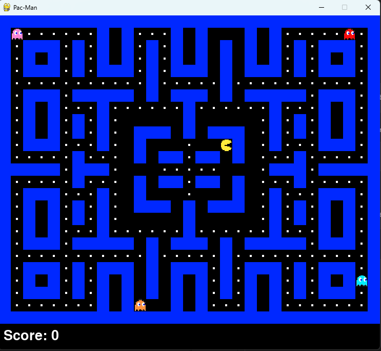

# PacMan game
## This is Project 1 for the Introductory Foundations of Artificial Intelligence course - a subject within the Faculty of Information Technology at the University of Science (HCMUS).

<div align="center">
  
</div>


## Team Members
1. Trần Xuân Minh Hiển - 22120102
2. Bùi Khánh Hưng - 22120119
3. Nguyễn Minh Hưng - 22120124
4. Hoàng Tiến Huy - 22120134

## Prerequisites
- Python 3 or higher
- pip (Python package manager)
  
## How to run

### 1. Clone this repository
``` bash
git clone https://github.com/simpleHuy/PacManGame.git
```

### 2. Navigate to the project directory:

``` bash
cd PacManGame
```
### 3. Install dependencies
``` bash 
pip install -r requirements.txt
```

### 4. Run the game:
``` bash
python source/main.py
```